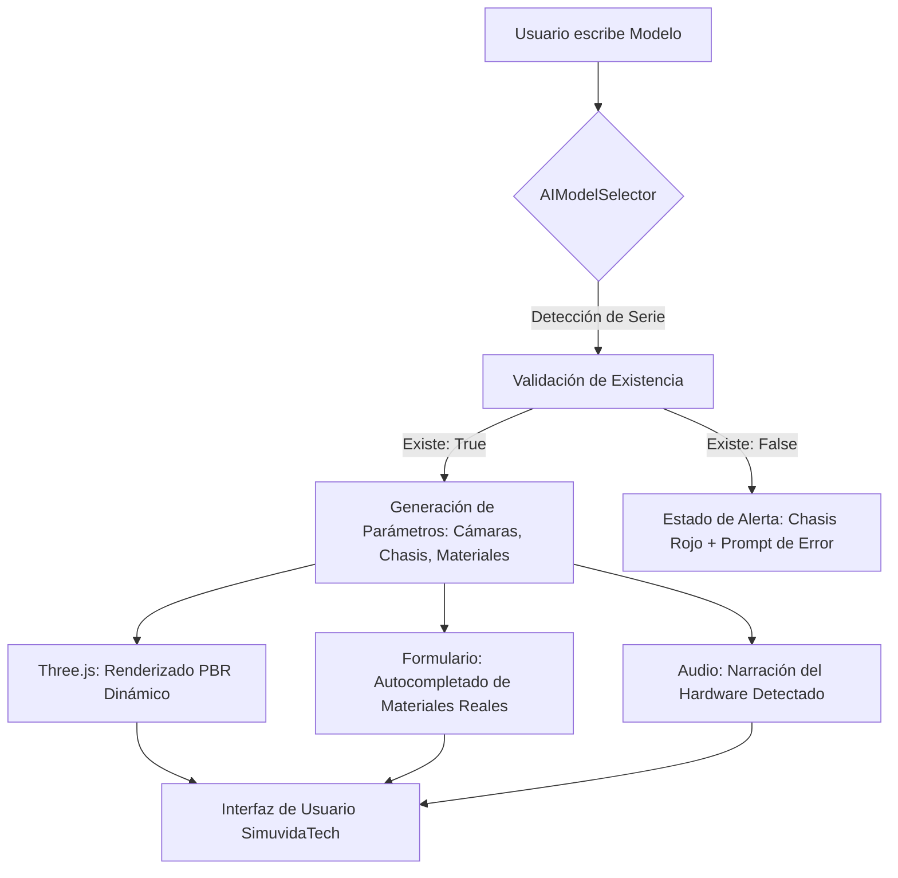

# Reporte Técnico: SimuvidaTech - Visualización 3D Accesible e IA de Hardware

## 1. Introducción y Justificación
La industria tecnológica contemporánea enfrenta un desafío ético y pedagógico crítico que hemos denominado "la desconexión material de la era digital". En un mundo donde la obsolescencia programada dicta el ritmo del consumo, la mayoría de los usuarios finales perciben sus dispositivos móviles y laptops como objetos monolíticos de cristal y metal, ignorando por completo la vasta y compleja cadena de suministro, así como el devastador impacto ambiental (especialmente en términos de huella hídrica y residuos de aparatos eléctricos y electrónicos, RAEE) que conllevan. Este proyecto, **SimuvidaTech**, surge como una respuesta tecnológica de vanguardia para cerrar esta brecha de conocimiento mediante la **Gemelización Digital proactiva**. La técnica de generación de modelos 3D en tiempo real impulsada por heurísticas de IA no es simplemente un adorno visual o una mejora estética; es, en su esencia, una herramienta de **concientización cognitiva y psicopedagógica**.

La justificación técnica y ética de esta implementación radica en lo que definimos como el "Principio de la Realidad Aumentada Mental". Al permitir que un usuario vea una representación física exacta, con materiales reales y geometría precisa de su propio dispositivo (detectado de forma dinámica y automática por el sistema) antes de siquiera iniciar una simulación, se produce un fenómeno sociotécnico de transferencia de empatía hacia el objeto. Cuando el usuario interactúa con un modelo que reconoce como el suyo (porque tiene el mismo número de cámaras, el mismo acabado de titanio o aluminio, y sus mismos materiales internos), la simulación de impacto deja de ser un ejercicio estadístico abstracto y se convierte en una experiencia personal. "No es un teléfono genérico el que se está analizando; es **mi** dispositivo, con **mi** litio y **mi** cobalto". 

Esta técnica es vital para el éxito del proyecto final porque ataca directamente la barrera de la carga cognitiva. A través del autocompletado inteligente de materiales y la asistencia auditiva en tiempo real, permitimos que personas con diferentes capacidades de procesamiento sensorial (neurodiversidad) puedan navegar por conceptos técnicos complejos de sostenibilidad sin sentirse abrumados. La precisión extrema en la validación de modelos (como el rechazo proactivo de dispositivos inexistentes o series ficticias) no es opcional; es el pilar que sostiene la autoridad científica del sistema. Al asegurar que el gemelo digital sea verosímil, transformamos una simple aplicación web en un **oráculo técnico-ambiental** capaz de modificar hábitos de consumo a través de la evidencia visual y auditiva de alta fidelidad, garantizando que cada decisión de reparación o reciclaje simulada tenga un peso real en la psique del usuario.

## 2. Fundamento Teórico-Técnico
La solución se basa en dos pilares científicos fundamentales:

*   **PBR (Physically Based Rendering):** A diferencia del renderizado tradicional, el PBR utiliza modelos matemáticos para simular cómo la luz interactúa con las superficies basándose en propiedades físicas reales como la **Albedo** (color base), la **Rugosidad** (roughness) y la **Metalicidad**. En SimuvidaTech, esto permite que un "iPhone Pro" no solo parezca gris, sino que su material refleje la aspereza del titanio versus el acabado brillante de un modelo estándar, mejorando la percepción espacial y el realismo sin necesidad de texturas pesadas.
*   **Gemelización Digital Proactiva (Digital Twin):** Este concepto se refiere a la creación de una réplica virtual de un objeto físico que vive en sincronía con sus datos. Nuestra implementación utiliza **Lógica Difusa (Fuzzy Logic)** en el servicio de IA para interpretar entradas de texto ambiguas y transformarlas en una estructura geométrica (número de lentes de cámara, grosor de chasis, materiales químicos) que representa al gemelo digital del dispositivo del usuario.

## 3. Arquitectura de la Solución
El stack tecnológico se compone de:
- **Frontend**: React.js con Vite para una reactividad ultra-rápida.
- **Gráficos 3D**: Three.js integrado con `@react-three/fiber` y `@react-three/drei`.
- **Accesibilidad**: Web Speech API para síntesis de voz (TTS) dinámica.
- **Servicios de IA**: `AIModelSelector` como motor de inferencia de hardware.

### Diagrama de Flujo de Datos

## 4. Auditoría de Implementación
Para la construcción de esta solución se utilizó asistencia de IA (Antigravity) con los siguientes prompts y ajustes manuales:

*   **Prompts Clave:**
    - "Genera un componente de React que renderice un teléfono 3D cuyas cámaras y dimensiones cambien según props dinámicos."
    - "Crea un servicio que valide si un modelo de Samsung o Apple existe basándose en rangos de producción reales hasta 2026."
*   **Errores Corregidos y Ajustes Manuales:**
    - **Falsos Negativos:** Inicialmente, el sistema bloqueaba series reales como la "Samsung A90". Se ajustaron manualmente los regex para permitir estas series históricas.
    - **El "Problema del Cero":** El sistema validaba "Dell XPS 0". Se implementó un filtro manual de coherencia numérica para asegurar que series de gama alta no aceptaran valores nulos o absurdos.
    - **Debouncing de Audio:** La voz de la IA se solapaba al escribir rápido. Se añadió un `setTimeout` de 800ms para asegurar que el asistente solo hable cuando el usuario ha terminado de teclear.

## 5. Conclusiones Técnicas
La principal limitación encontrada fue la **Potencia de Cómputo en Navegador**. Renderizar modelos PBR con múltiples luces y hotspots interactivos puede aumentar la temperatura del hardware en dispositivos móviles de gama baja. 

Otra limitación crítica es la **Fragmentación de Nomenclatura**: existen miles de modelos de laptops con nombres incoherentes. La IA actual es excelente con marcas líderes (Apple, Dell, HP), pero requiere una base de datos más profunda para marcas emergentes o modelos regionales para evitar que caigan injustamente en la categoría de "No verificado".
